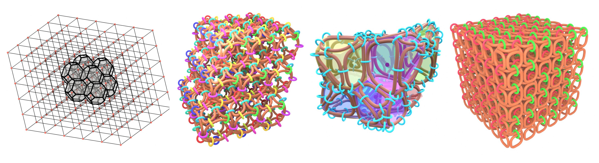

# Triply Periodic Mesh-Based Linked-Structures

- Installation
- Documentation



## Installation
This project relies on experimental features of Blender that is not merged into alpha release. The exact Blender build version can be found [here](https://projects.blender.org/bebop_artist/blender/src/commit/56e57acc34ed495933bb7213eff54288df18881d]). Dependencies for building the source code of Blender depends on the operating system:
- [Linux](https://developer.blender.org/docs/handbook/building_blender/linux/)
- [macOS](https://developer.blender.org/docs/handbook/building_blender/mac/)
- [Windows](https://developer.blender.org/docs/handbook/building_blender/windows/)

Clone the previously mentioned Blender branch with the provided commit hash:
```
git clone https://projects.blender.org/bebop_artist/blender.git
git checkout 56e57acc34ed495933bb7213eff54288df18881d
```
If the dependencies are all installed for the platform, then do the following for building Blender:
```
make update
make
```
This should create a build folder in the parent directory `../build_<platform>_<build_type>_<architecture>_<compiler_used>/`. Binary executable for Blender should be in `../build_<platform>_<build_type>_<architecture>_<compiler_used>/bin/`.

Using the built Blender executable you can open `.blend` files in `/blends/` folder.

### Example Figure Script

Run the [`generate_figure.bat`](scripts/generate_figure.bat) to do all the steps above in a Windows machine. It will clone the Blender source code, build it and run Blender with one of the files in the `blends` directory and show an example 3D scene. Generated figure will be in `images/example_figure_1.jpg`

## Documentation

- [`WS.blend`](blends/WS.blend): Generates Wigner-Seitz cells from given Bravais Lattice parameters
- [`RANDOM_MESH.blend`](blends/RANDOM_MESH.blend): Generates links from Voronoi tesselation of point clouds either defined by user or randomly generated.
- [`WS_LINKS.blend`](blends/WS_LINKS.blend): Generates and enumerates linked-structures for different Wigner-Seitz cells.
- [`NS_CUBIC.blend`](blends/NS_CUBIC.blend): Selectively puts edge-based links depending provided shape value `n` and shifting values `s1` and `s2`.
- [`MANUAL.blend`](blends/MANUAL.blend): Manual mesh based linked structure generator.